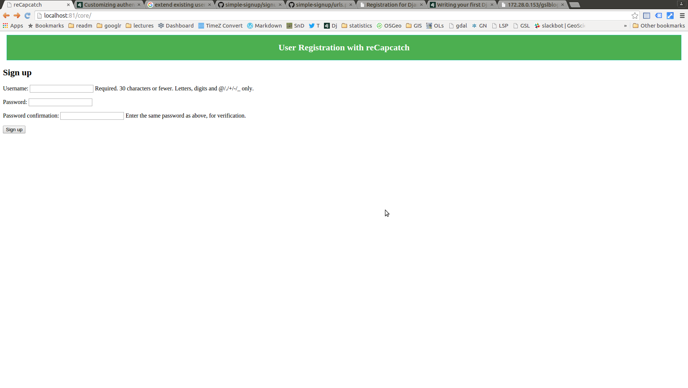

First thing first, let make apache find our new project. Go to /etc/apache2/sites-availabe and make a file yourproject.conf and paste some thing like this


```
<VirtualHost *:82>
        WSGIScriptAlias / /home/opiyo/Dropbox/mydjango/aerial/aerial/wsgi.py

        ServerName firstproj.com
        Alias /static /var/www/aerial/static/


        <Directory "/home/opiyo/Dropbox/mydjango/aerial">
                Order allow,deny
                Options Indexes FollowSymLinks
                Allow from all
                IndexOptions FancyIndexing

 				<Files "wsgi.py">
              		Require all granted
       			</Files>

        </Directory>


</VirtualHost>

```

now make a link to site-enable folder

```

cd /

sudo ln -s /etc/apache2/sites-availabe/file.con /etc/apache2/sites-enable


PS: some how i had to go to root otherwise the ln command was not make a proper link.
```

restart apache

```

sudo serivce apache restart

```


django-admin.py startproject register

Ran into a error

```
Thu Aug 31 12:36:47 2017] [error] [client 127.0.0.1] File does not exist: /etc/apache2/htdocs
[Thu Aug 31 12:42:47 2017] [notice] caught SIGTERM, shutting down
[Thu Aug 31 12:42:48 2017] [error] python_init: Python version mismatch, expected '2.7.2+', found '2.7.3'.
[Thu Aug 31 12:42:48 2017] [error] python_init: Python executable found '/usr/bin/python'.
[Thu Aug 31 12:42:48 2017] [error] python_init: Python path being used '/usr/lib/python2.7/:/usr/lib/python2.7/plat-linux2:/usr/lib/python2.7/lib-tk:/usr/lib/python2.7/lib-old:/usr/lib/python2.7/lib-dynload'.
[Thu Aug 31 12:42:48 2017] [notice] mod_python: Creating 8 session mutexes based on 150 max processes and 0 max threads.
[Thu Aug 31 12:42:48 2017] [notice] mod_python: using mutex_directory /tmp
[Thu Aug 31 12:42:48 2017] [notice] Apache/2.2.22 (Ubuntu) PHP/5.3.10-1ubuntu3.9 with Suhosin-Patch mod_python/3.3.1 Python/2.7.3 mod_wsgi/3.3 configured -- resuming normal operations
[Thu Aug 31 12:42:57 2017] [error] [client 127.0.0.1] mod_wsgi (pid=7401): Exception occurred processing WSGI script '/home/geoinformatics/Dropbox/mydjango/register/register/wsgi.py'.
[Thu Aug 31 12:42:57 2017] [error] [client 127.0.0.1] Traceback (most recent call last):
[Thu Aug 31 12:42:57 2017] [error] [client 127.0.0.1]   File "/usr/local/lib/python2.7/dist-packages/django/core/handlers/wsgi.py", line 187, in __call__
[Thu Aug 31 12:42:57 2017] [error] [client 127.0.0.1]     self.load_middleware()
[Thu Aug 31 12:42:57 2017] [error] [client 127.0.0.1]   File "/usr/local/lib/python2.7/dist-packages/django/core/handlers/base.py", line 44, in load_middleware
[Thu Aug 31 12:42:57 2017] [error] [client 127.0.0.1]     for middleware_path in settings.MIDDLEWARE_CLASSES:
[Thu Aug 31 12:42:57 2017] [error] [client 127.0.0.1]   File "/usr/local/lib/python2.7/dist-packages/django/conf/__init__.py", line 54, in __getattr__
[Thu Aug 31 12:42:57 2017] [error] [client 127.0.0.1]     self._setup(name)
[Thu Aug 31 12:42:57 2017] [error] [client 127.0.0.1]   File "/usr/local/lib/python2.7/dist-packages/django/conf/__init__.py", line 49, in _setup
[Thu Aug 31 12:42:57 2017] [error] [client 127.0.0.1]     self._wrapped = Settings(settings_module)
[Thu Aug 31 12:42:57 2017] [error] [client 127.0.0.1]   File "/usr/local/lib/python2.7/dist-packages/django/conf/__init__.py", line 132, in __init__
[Thu Aug 31 12:42:57 2017] [error] [client 127.0.0.1]     % (self.SETTINGS_MODULE, e)
[Thu Aug 31 12:42:57 2017] [error] [client 127.0.0.1] ImportError: Could not import settings 'register.settings' (Is it on sys.path? Is there an import error in the settings file?): No module named register.settings

```

well I solved this long ago by using the trick below


```
add sys to import

Set CURRENT_DIRECTORY

and then append it to sys path


code

import os,sys


CURRENT_DIRECTORY = os.path.abspath(os.path.dirname(__file__))

sys.path.append(os.path.abspath(os.path.join(CURRENT_DIRECTORY, '..')))


```

If you have static files, do the follwoing

1. make static folder in project root
2. make project folder in /var/www (same name)
3. do not forget to set STATIC_ROOT in settings.py , path could be like '/var/www/aerial/static'
3. from project forlder run python manage.py collectstatic

Better to set database (if you are using), put the following in settings.py

```

DATABASES = {
    'default': {
        'ENGINE': 'django.db.backends.mysql',
        'NAME': 'database',
        'HOST': 'localhost',
        'USER': 'username',
        'PASSWORD': 'password'
    }
}

```

Now you should have database in (i am using mysql so )

```
mysql -u root -p

createdb database databasename

```

Now I go to project root folder and run

```
python manage.py syncdb
```

I created an app in project

```
python manage.py startapp core
```

Now so URL related issues came but managed to solve them e.g in core/urls.py I changed the line

```
from register.core import views
```

to

```
from core import views
```

Now I could see the signup page

http://localhost:81/core/



But now wanted to see the admin page to make sure if I add user they go into a database. When I visited admin/ module got error that table is not in db.

So used syncdb command

```
python manage.py syncdb
```

error came

```

CommandError: One or more models did not validate:
admin.logentry: 'user' has a relation with model accounts.User, which has either not been installed or is abstract.
auth.user: Model has been swapped out for 'accounts.User' which has not been installed or is abstract.

```
