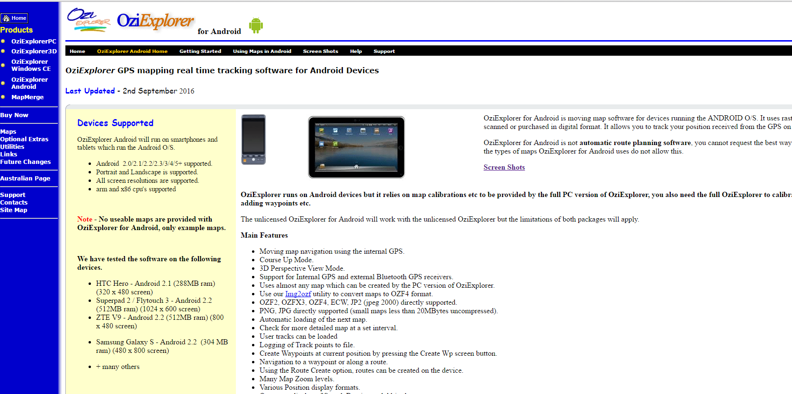
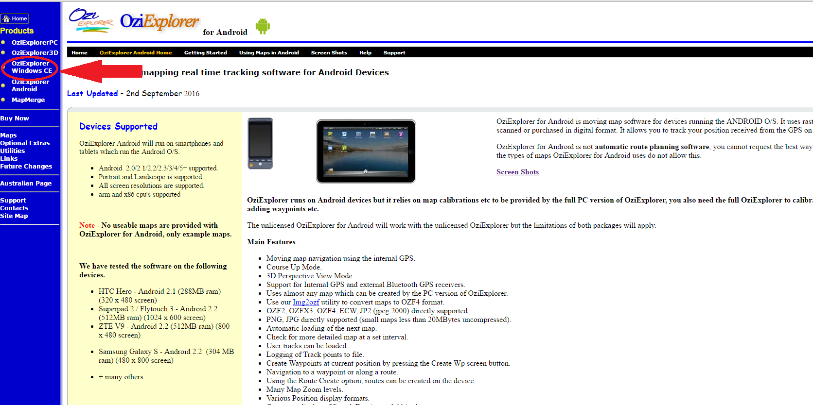

*Last updated: 20/7/2016*

OziExplorer is a software that can create way points, paths from shape files for mobile devices. OziExplorer is a licensed software, thus, the mobile versions are also licenses for example OziExplorer for Android or OziExplorerCE (for windowsCE devices llike Trimble Juno 3B).

### Installation
##### Desktop

##### Device
Usually, the mobile devices used for OziExploreCE has WindowsCE operating system. For such devices, windows mobile device centre is required on the desktop computer. If not installed, go to following link and install it.

__Windows 7__

[Windows 7](http://www.microsoft.com/windowsmobile/en-us/downloads/microsoft/device-center-download.mspx)

__Windowx XP__

One extra step is required for XP that is to install Active Synx 4.5

Now the device center is installed, let look at the OziExplorer installation steps

1. Go to OziExplorer website [link](http://www.oziexplorer.com/). See the website below

Image: 

2. Click OziExplorereCE (pointed by red arrow)

Image: 

3. Select the option "Windows Mobile and Pocket PC", shown below

Image: 

Note: this will download an executable file (with extension exe).

4. Now connect device with computer. It will take couple of minutes to synchronize the device with computer.

5. Once Synchronized, double click on the executable file (the one which was downloaded in step 3). The installation should start.

5. Finally, once the installation is done, provide license information. Start OziExplorerCE software on the device and wait for few second, a window will appear for Name of the person who owns the license and the license code.

### How to load points and Export as waypoint

1. Load shape file of points into Ozi desktop software.

Note: better to prepare one column for labels as only one column will be exported to waypoint file. Thus, its better to prepare one column for the purpose of waypoint labeling. Also note that waypoint label has a limit of 8 characters , thus, it has to be short.

2. For exporting loaded (in step 1) points to waypoint file, Open menu "file" then select "save to file" then select "save points to file (set 1 only )"" then select  "save points to waypoint file"  option

3. Manually, copy the waypoint file in ../OziExplorer/data/ folder on device.

4. Start OziExplorer and goto "file - waypoint - waypoit list from file" to load waypoints into OziExplore software.

5. Now you can select the option "goto nearest waypoint" to see the direction and distance of the nearest waypoint.

### Track oziExplorerCE
Follow the steps below to make route/track on OziExploreCE

1. Start OziExplorerCE
2. Goto Menu
3. Select File
4. Select Track log
4. select Log Track to File

Note: Log track to File option is toggle thus make sure it has a tick on left side

After making route, export file as txt file by using the option

OziExplorerCE -> Menu -> File -> Track log -> Track log -> File-Export Track Tail to File.

Also read the [configuration(http://www.oziexplorer3.com/ozice/help/ozice_d_working_tracks.html) file. 

## How to download data from OZiExplorer

Export data
Most of the time we only care about shape files, so here is how you can export data.

1) First load the data on to OziExplorer desktop software by using the option

Menu File -> load from file -- (1) Load waypoints from file (2) Load tracks from file (mulit)

Now Goto device data folder where you path/waypoints are and load.

OR

You can just open device-data folder and copy paste the files in a folder on your PC and load from there using the same option (Menu -> File-load from file)  

Another option is to export the waypoints or tracks to a .txt file using the options on the Save Menu. Open the file in a text editor, you may be able to manipulate the data in a text editor to the format you require for the other software.
