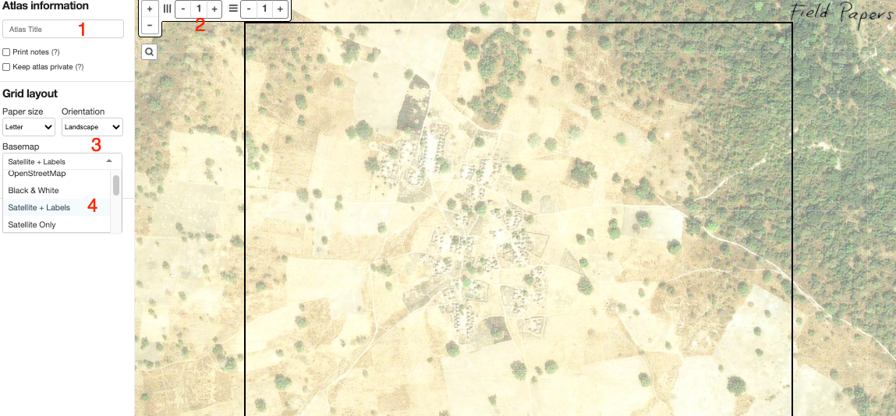
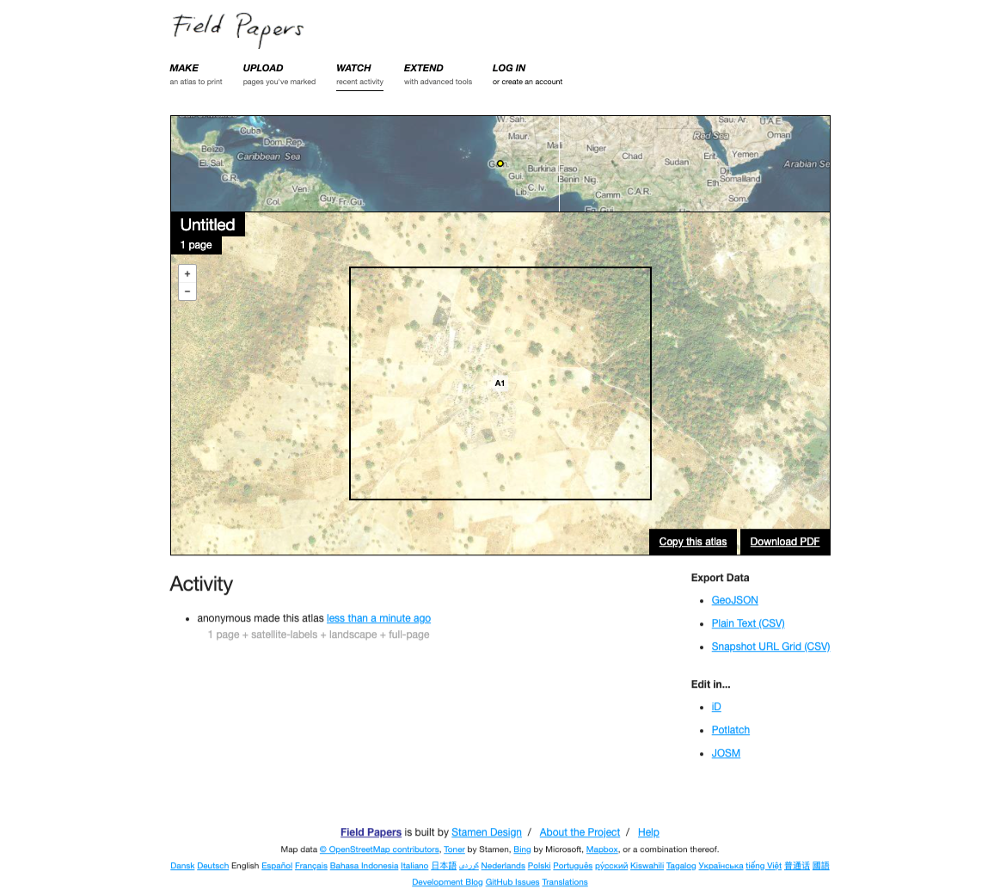
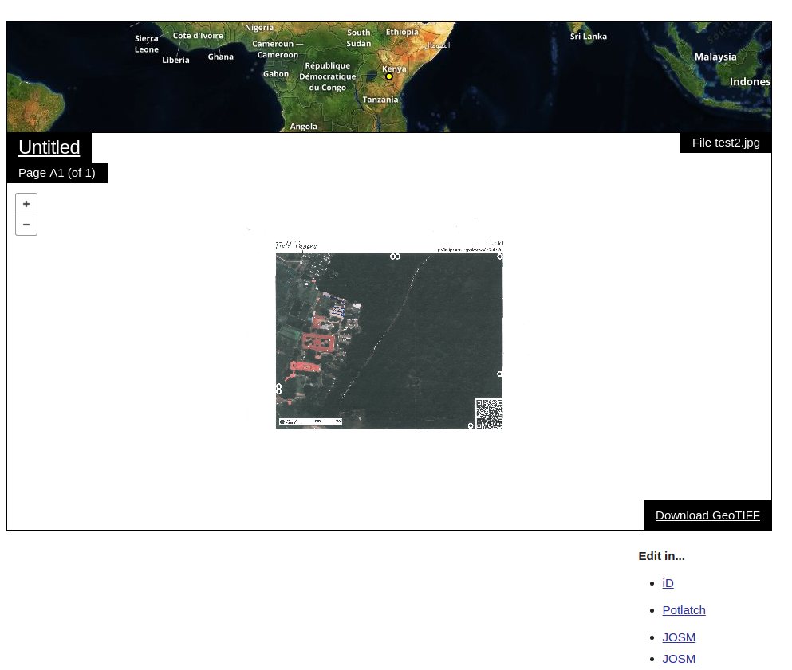

*Last Updated: 10/10/2020*

[Field papers](http://fieldpapers.org/) is an excellent tool for spatial field surveys and participatory GIS. It is very easy to use. All you have to do is

1. Register an account on [http://fieldpapers.org/](http://fieldpapers.org/)
2. Click on Make an Atlas by panning and zooming to your required area.
3. Now by looking at the image below, perform the tasks as marked on the following image

- [x] Add text here (if required to be added to the field paper print out.) One can use this option to add import instructions for field staff.  
- [x] Use one page per image, thus, set both horizontal and vertical page options to 1.
- [x] Set paper option to landscape (it helps in getting a bigger image).
- [x] f using satellite images, use Mapbox (if possible) as base layer. Issue with Bing maps is that some times it shows blackboxes on images (all the time in my case)

4. When the above steps are completed, press option "Make Atlas".
5. Next, download the atlas as PDF as shown in the image below.

> Note, the QR on paper sheet, it contains critical information like georeferencing information.

6. Print the downloaded PDF and provide it to field teams.

6. Field teams need to draw point, line and polygons and provide labels on paper. Encourage field teams to provide extra information as notes on the same paper.

6. When field teams returns the printed papers,  Scan the papers (taking photo will also work but scanning will give better results)
7. Upload the scanned field papers as .jpeg (or other formats) to field paper website website. Once uploaded the your image will look similar to the one bllow on Field Paper website.  

8. Now from here you can do two thing

+  Click iD and field paper website will take you to OSM web page. Login and you will see your scanned image as one of the layer on map. Now you can digitize your work directly in OSM.

+ Click on download button and get a GeoTiff. Now use can any GIS(for example QGIS) software to (a) start a shape file (b) start digitizing.

[reference](http://gis.stackexchange.com/questions/192798/how-to-use-data-from-field-papers-to-qgis).   

Its pretty awesome :).

Icon references: 
<a href="https://icon-library.net/icon/twiter-icon-15.html">Twiter Icon #268986</a>
