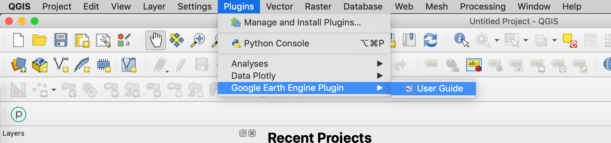
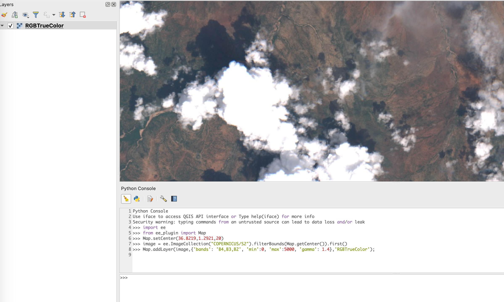

# How to install and use Earth Engine plugin in QGIS 3.

### Installation
Few days back I read about [Google Earth Engine (GEE) plugin for QGIS](https://gee-community.github.io/qgis-earthengine-plugin/). The installation was straight forward (by using the QGIS plugins menu option Manage and Install plugins). Now, I could see the GEE Plugins in QGIS Plugins menu (as shown below).  



Once installed, the plugin tried to authenticate my GEE account but when I provided the authorization key, I got an error that I am missing a library (I might have missed some thing).


Later I found out that I do not have __earthengine-api__ install on my computer. This part was not obvious to me in the beginning and was not mentioned in the documentation. So I installed the earthengine-api library using the following commands.

```
sudo pip3 install earthengine-api
```

for python 2

```
sudo pip install earthengine-api
```

Now an other step I found in the GEE python [documentation](https://developers.google.com/earth-engine/python_install-conda.html) was to get oauth2 key for your GEE account by using the following command (open a terminal and execute the command below).  

```
earthengine authenticate
```

Note: The above command will open a web page in your default web browser and will ask you to authorize the newly installed GEE plugin to use your GEE credentials. Once you put your password, you will see the following output in the terminal (where you have executed the command __earthengine authenticate__)


```

Running command using Cloud API.  Set --no-use_cloud_api to go back to using the API

To authorize access needed by Earth Engine, open the following URL in a web browser and follow the instructions. If the web browser does not start automatically, please manually browse the URL below.

    https://accounts.google.com/o/oauth2/auth?client_id=????????????-.............

The authorization workflow will generate a code, which you should paste in the box below.
Enter verification code: --------------your auth key here -------------------------

Successfully saved authorization token.

```

Thats it, installation is complete and now you can use the GEE plugin in QGIS python console.

### Usage

Now you can use the QGIS plugin.The python code to load and search for images.

```
import ee
from ee_plugin import Map

Map.setCenter(36.8219,1.2921,20)   

image = ee.ImageCollection("COPERNICUS/S2").filterBounds(Map.getCenter()).first()
Map.addLayer(image,{'bands': 'B4,B3,B2', 'min':0, 'max':5000, 'gamma': 1.4},'RGBTrueColor');

```

Output




Note, the above code is taken from [GEE plugin page](https://gee-community.github.io/qgis-earthengine-plugin/), except the coordinates for Nairobi.
