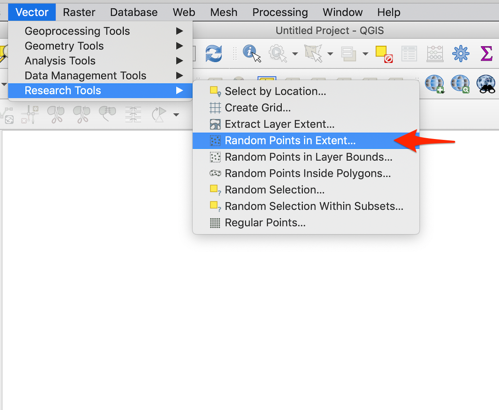
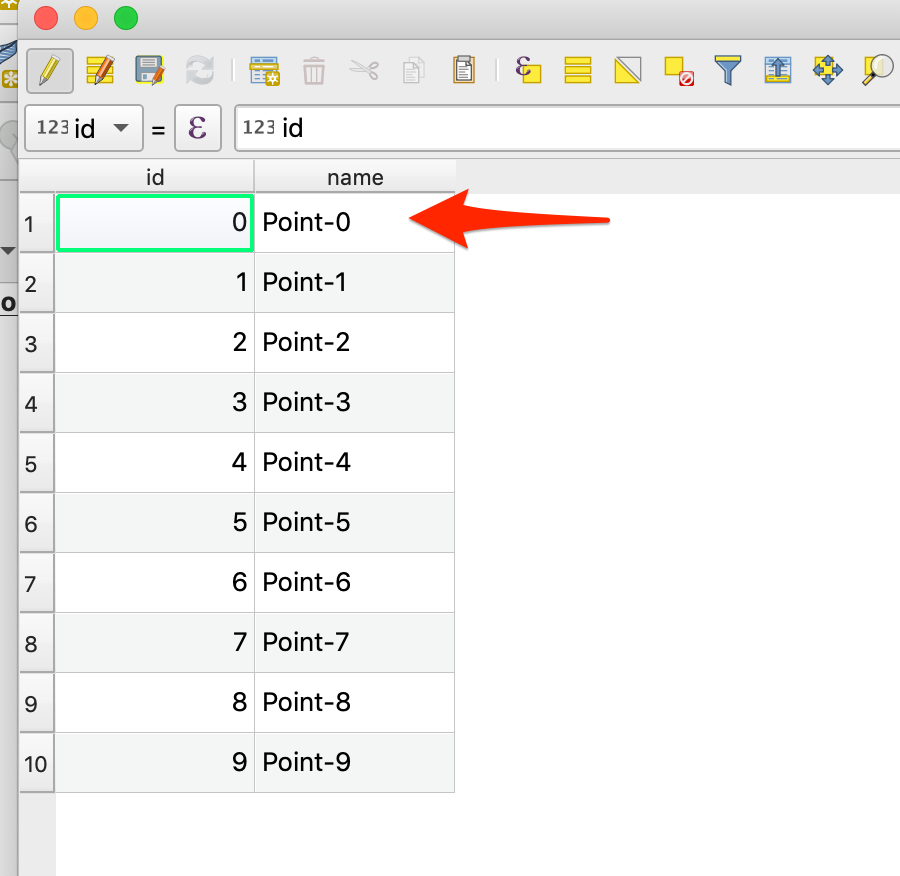

<a href="https://twitter.com/intent/tweet?text=How%20to%20generate%20random%20points%20in%20QGIS%20and%20export%20as%20GPX%20file%20https://mnahmad.github.io/scriptndebug/pages/qgis/random_points_gpx/generate_random_points.html%20@mnabiahmad"></a>

*Last update: 02/11/2019*


### Area of Interest for generating random points.

There are three ways to define area of interest in QGIS and these are

- Use canvas extent as area of interest
- Use an existing polygon shape file or create a new shape file
- Use layer bounding box as area of interest

For this blog, I will use the second approach. Go to the QGIS vector menu, click Research tool and finally click __Random Points in Extent__ , as shown in the image below.

<br/>

A new window will appear with title *Random Points in Extent*, as shown in the image below.

<br/>

Select the input extent button  next to extent text box and use the option *Canvas as Extent*. Next, select the number of points you want to generate, I will generate 10 points.  

For the option *Minimum distance between points*, if you project is not in projected coordinates you will see __degrees__ as unit. For this blog, I will not change to a projected coordinate system but you should.

For option *Target CRS*, select a Coordinate Reference System (CRS) that you require. I will stick with the default option of EPSG:4326.   

Finally, provide a name and path for your random points shape file and press __Run__ button. I got the following output.

<br/>

Now, lets look at the attritue table of newly created shape file (shown below).


There is only one field __id__, we want to show point name on our GPS device (or in an app using cell phone). In order to show name of random point, we have to add a filed called __name__ in the attribute table (and you cannot use capital letters in field name). To add a new field, first switch this shape file to __Edit__ mode by pressing the edit button (pointed by red arrow in the image above). Second, press the __Field Calculator__ button to add a new field. You should be able to see a windown as shown below.

<br/><br/>

Add field name as __name__, select __text__ as type. Here I want to use the __concat__ function to concatenate string and point id (it looks better), thus, I used the function __concat__ and used __id__ filed (point by "Field name" red arrow). The Expression is similar to the one shown in the code section below.  

```
concat('Point-','id')
```

Press ok and you should be able to see new field name in the attribute table (as shown below).



Finally, as your shape file is still in __Edit__ mode, delete the *id* field.

Don't forget to switch off the __Edit__ mode of your shape file.

Now finally, export this shape file (in my case temporary layer) as GPX file. Now, when I loaded my GPX file an android navigation app (LocusMap Free), not only I could see points but their names as well (as shown below).

<br/>

In an other blog, I will also show the process of loading GPX file to an android phone using a navigation app.  
