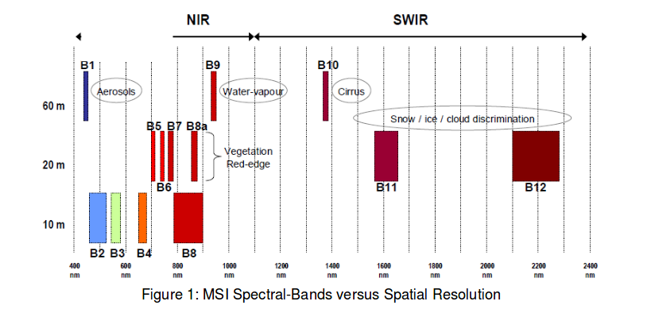

This post is a summery of the original discussion on [ESA's discussion forum](http://forum.step.esa.int/t/list-of-band-combinations-for-sentinel-2/1156/7), I just place it in one page for easy access.

### Landsat 8 band combinations

Natural Color 4 3 2

False Color (urban) 7 6 4

Color Infrared (vegetation) 5 4 3

Agriculture 6 5 2

Atmospheric Penetration 7 6 5

Healthy Vegetation 5 6 2

Land/Water 5 6 4

Natural With Atmospheric Removal 7 5 3

Shortwave Infrared 7 5 4

Vegetation Analysis 6 5 4

The above information is summarized from [ESA's discussion forum](http://forum.step.esa.int/t/list-of-band-combinations-for-sentinel-2/1156/7)

### Sentinel 2

Natural Colors: 4 3 2

False color Infrared: 8 4 3

False color Urban: 12 11 4

Agriculture: 11 8 2

Atmospheric penetration: 12 11 8a

Healthy vegetation: 8 11 2

Land/Water: 8 11 4

Natural Colors with Atmospheric Removal: 12 8 3

Shortwave Infrared: 12 8 4

Vegetation Analysis: 11 8 4

The above information is summarized from [ESA's discussion forum](http://forum.step.esa.int/t/list-of-band-combinations-for-sentinel-2/1156/7)

Following image ESA website also explains the above information in a nice way.

ESA's Sentinel documentation for [Sentinel 2 products](https://sentinel.esa.int/documents/247904/685211/Sentinel-2+Products+Specification+Document+%28PSD%29/0f7bedeb-9fbb-4b60-91aa-809162de456c)
