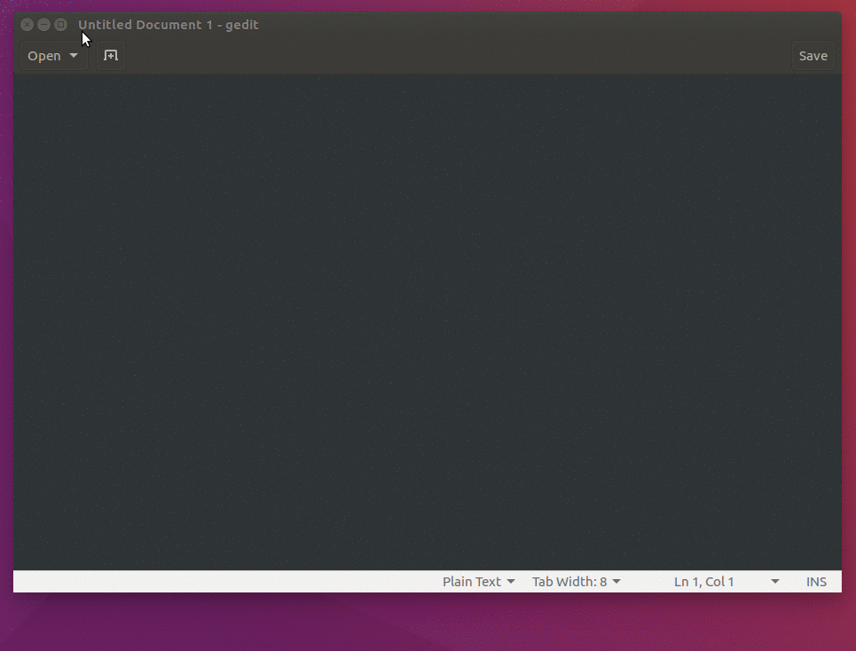
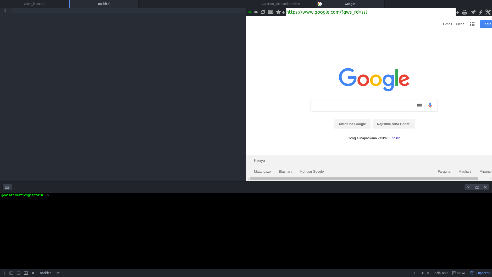

In the last few years, I tired many text editors like gedit, sublime, vi, vim and [Atom](https://atom-editor.cc/), the last one stuck with me for long. What I like about Atom is the packages, gedit and sublime also has packages for example I like cli panel in text editors, like Embedded Terminal in gedit

   

ref:
[https://cs50.stackexchange.com/questions/2026/how-do-i-open-a-terminal-window-in-gedit](https://cs50.stackexchange.com/questions/2026/how-do-i-open-a-terminal-window-in-gedit)

However, I needed a text editor that can support a cli and a webbrowser plugin. Atom does that as it has a terminal-plus, see below (don't install it before you read the complete blog) and browser-plus.



### Installation on Linux
Use the following commands on Ubunut to install Atom

```
sudo add-apt-repository ppa:webupd8team/atom
```

then

```
sudo apt update

sudo apt install atom

```

ref:
[http://tipsonubuntu.com/2016/08/05/install-atom-text-editor-ubuntu-16-04/](http://tipsonubuntu.com/2016/08/05/install-atom-text-editor-ubuntu-16-04/)

### Packages
Some of the packages I like are

```
atom-bootstrap4 ver 1.4.0

autocomplete-python 1.10.2
```
some other good autocomplete packages are

```
autocomplete-json

atom-django 0.3.2
```

and some other packages
```
browser-plus 0.0.98

emmet 2.4.3

linter-flake8 2.2.1

terminal-plus 0.14.5

platformio-ide-terminal
```

### Some Issue
Some installed packages could not be loaded because they contain native modules that were compiled for an earlier version of Atom like with terminal-plus package

Solution to terminal-plus package issue
https://github.com/jeremyramin/terminal-plus/issues/402

The solution worked on my unbunut 14 laptop, but I could not make it work on ubunut 16. I did some searching and then opted for "platformio-ide-terminal" as some one said it is not in development any more (the repo is at least one old https://github.com/jeremyramin/terminal-plus). The package "platformio-ide-terminal" works out of the box.

Note: For color change (in package setting), restart Atom after colors are changed.

if you want to remove atom, use the following command.

```
sudo apt remove --purge atom
```

What do you think, you want to give it a try. 


__Updates:__ Atom repository is archived since 2022 and no longer updated. Sad I wish they had continued. 