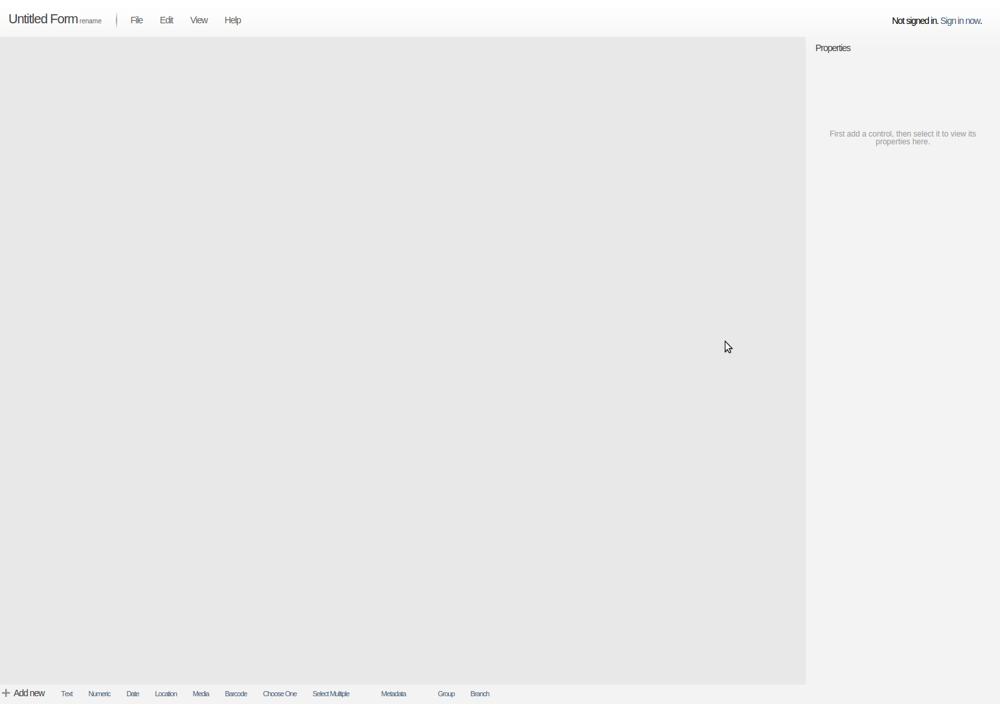

OpenDatakit (ODK) is a well know mobile data collection paltform. I was using CyberTracker for field data collection and wanted to use with ODK for easy of use. One advantage was that it was available on Android (unlike CyberTracker which supports windowsCE). At the time of this writing, ODK had three simple components (as discribed by the website)

* Build 
* Collect 
* Aggregate 

## Build
Usually one wants a questionare to be programmed into a device which can be filled in the field. Build component will allow you to create a form. Each quesiton in (if not grouped) will be a simple screen on device (screens/windows are also called activity in terms of android programming), but you can group multiple questions into one screen. 

There are two ways to build a form. Through GUI or excel sheet. The GUI is availabel at [ODK webite](http://build.opendatakit.org/), you need registration to save your forms, otherwise, you do not need to register if you are just designing forms and exporting them into xml. See the GUI below 

ODK build: 

All the controls are at the bottom of the page, click on one of them (like Text, Numeric or Date) and the control will appear on the form. For each control on the form, properties can be set by using the right hand property window (see below)  

Once done with the form design and properties settings, one easy way is to just export it as xml. Go to File - Export to XML option, your form will appear.

Download this form. You can directly add form to your modile device. However, some of the advance functionalty is not present in ODK Build, thus, one has to use xls option. 

## ODKCollect
ODK Collect is the androind app that is connected with the server to download survey forms, it is an offline app, thus, does not require internet during data collection, read more about it at [this](https://getodk.org/) link, **note this link is updated as this blog is almost 8 yeares told**.  

One interesting thing about OKD Collect is that one can load raster data to device by converting raster format to MBTiles and then load it to GeoODK, with this one can view any raster data in the field without internet access. __Note, since this blog is old, thus, please read details on the offical GeoODK site at__ [this](http://geoodk.com/xlsform_converter.php)link.  

## Aggregate
Aggregate is (was as of now) was a the server side where forms were uplaoded (in the form of xml). Aggrigate was written in Java and had a simple but effective interface. I used it couple for couple of years before moving to ODK Central (and that is a story for an other day). 

**Note, this post is old, however, tells a story of an era of ODK.**
