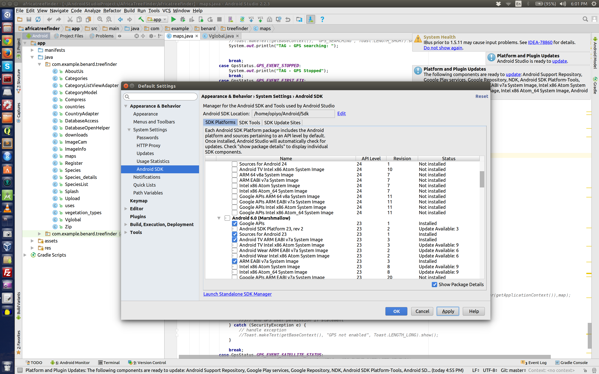
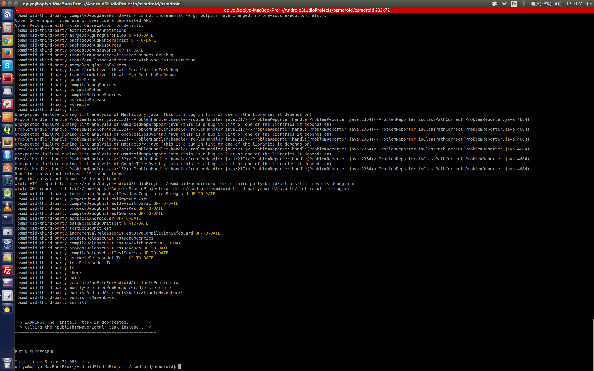

Osmdroid is a Java package for android that provides mapping functionalities. I been working with this package for the past one year. Its has certain advantages

* Easy to use
* Open Source
* No key required   

Taking the advantge of being open source, I wanted to make a small change as follows

Objectives
1.	Change PNGs for location (person, arrow)
When GPS gets a fix, there are two default icons for location, but I needed one (cross-hair).

2.	Change the name of the device folder from osmdroid to my_app_name

First thing first, download the source from osmdroid git [repo](https://github.com/osmdroid/osmdroid) and make the required changes.

First task was easy, I just renamed the default icons and copied my icon with the default icons name. 

Second objective required code level change at multiple places (at least this was my understanding at the time of this task)

Follow the steps given by [osmroid build from source page](https://github.com/osmdroid/osmdroid/wiki/how-to-build-osmdroid-from-source), I used the second option that is "build with gradle".

As explained by documentation, I went to the folder where I had downloaded osmdroid and ran the following command

```bash
gradlew clean install
```

Oops, got error

```css
Building version 5.6.5-SNAPSHOT of your project...

WARNING: No Android release signing configuration provided!

FAILURE: Build failed with an exception.


* What went wrong:
> A problem occurred configuring project ':GoogleWrapperSample'.
> SDK location not found. Define location with sdk.dir in the local.properties file or with an ANDROID_HOME environment variable.

* Try:
Run with --stacktrace option to get the stack trace. Run with --info or --debug option to get more log output.

BUILD FAILED

Total time: 2 mins 29.653 secs
```

I searched couple of options and [this](http://stackoverflow.com/questions/26356359/error-android-home-is-not-set-and-android-command-not-in-your-path-you-must-ful) and [this](https://spring.io/guides/gs/android/) put me in the right direction. Summery of these post is that I had to find SDK location, thus, according to this [link](http://stackoverflow.com/questions/19794200/gradle-android-and-the-android-home-sdk-location) I had to create local.properties file in root folder of osmdroid , I did that plus added ANDROID_HOME as follows

```bash
set ANDROID_HOME=/home/opiyo/Android/Sdk
```

this solved the above issue but now a new issue came

```css
----------------------- error -----------------------


===================================================================
==> WARNING: No Android release signing configuration provided! <==
===================================================================


FAILURE: Build failed with an exception.

* What went wrong:
A problem occurred configuring project ':GoogleWrapperSample'.
> failed to find target with hash string 'Google Inc.:Google APIs:23' in: /home/opiyo/Android/Sdk

* Try:
Run with --stacktrace option to get the stack trace. Run with --info or --debug option to get more log output.

BUILD FAILED

Total time: 6.795 secs


-----------------------------------------------------
```

This one was hard to address, read this [issue](http://stackoverflow.com/questions/35450417/errorcause-failed-to-find-target-with-hash-string-google-inc-google-apis23) and applied but no change and then saw this [link](http://stackoverflow.com/questions/33417537/failed-to-find-target-with-hash-string-android-23) and when checked found out that I do not have Google APIs 23 (see my setup in below image).

{.lightbox}

I installed the API library. Compiled again and the compile process started, it took some time.

Finally, the build was successful, goto folder /home/user/AndroidStudioProjects/osmdroid/osmdroid/build/generated and the jar file was there.

{.lightbox}

If you wanted to read about gradlew, read this [answer](http://stackoverflow.com/questions/39627231/difference-between-using-gradlew-and-gradle)

For PNGs change the path was

https://github.com/osmdroid/osmdroid/tree/master/osmdroid-android/src/main/res/drawable

on local it was at following 

```bash
/home/user/AndroidStudioProjects/osmdroid/osmdroid/osmdroid-android/src/main/res/drawable
```

Following helped in adding lib to my project. 


https://stackoverflow.com/questions/29826717/how-to-import-a-aar-file-into-android-studio-1-1-0-and-use-it-in-my-code


http://abhiandroid.com/androidstudio/import-add-external-jar-files-android-studio.html


https://github.com/MagicMicky/FreemiumLibrary/wiki/Import-the-library-in-Android-Studio


and http://stackoverflow.com/questions/16608135/android-studio-add-jar-as-library
